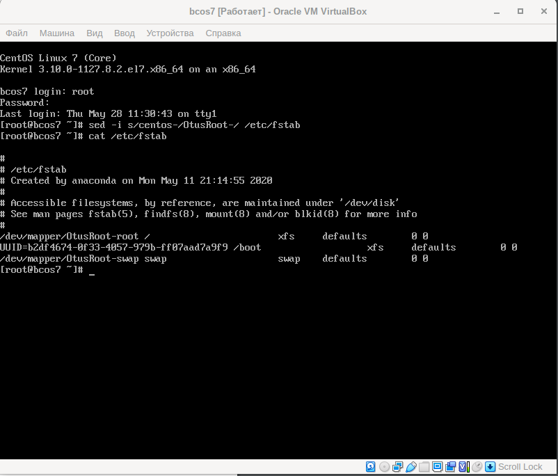

# Практика Загрузка Linux

## Попадаем в систему без пароля.

### Способ 1. init=/bin/sh

+ В конце строки начинающейся с linux16 добавляем init=/bin/sh и нажимаем сtrl-x для загрузки в систему.

### Способ 2. rd.break

+ В конце строки начинающейся с linux16 добавляем rd.break и нажимаем сtrl-x для загрузки в систему.

### Способ 3. rw init=/sysroot/bin/sh

+ В строке начинающейся с linux16 заменяем ro на rw init=/sysroot/bin/sh и нажимаем сtrl-x для загрузки в систему.

## Установить систему с LVM, после чего переименовать VG

+ Посмотрим текущее состояние системы и переименуем centos в OtusRoot:

+ Далее правим /etc/fstab, /etc/default/grub, /boot/grub2/grub.cfg. Везде заменяем старое название на новое.

+ Пересоздаем initrd image, чтобы он знал новое название Volume Group.

+ После чего можем перезагружаться и, если всё сделано правильно, то успешно грузимся с новым именем Volume Group и проверяем:

## Добавить модуль в initrd

+ Результат на скриншоте:

